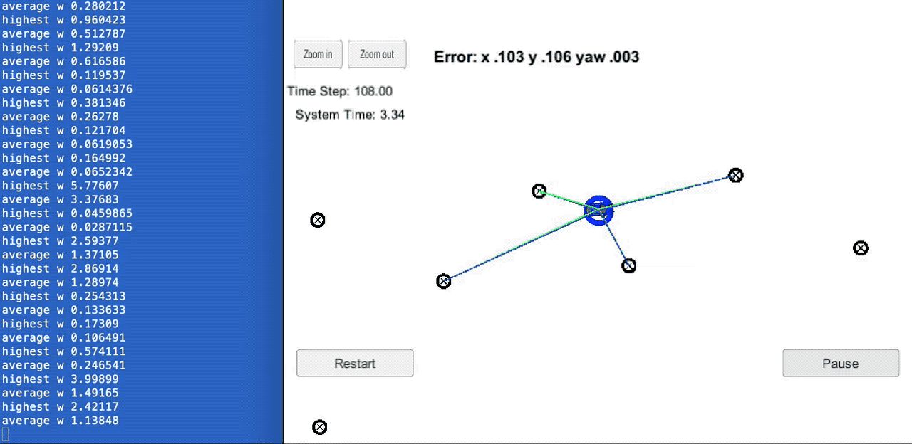

# CarND-Overview
This repository gives an overview of all the projects developed for the Udacity Self Driving Car Nanodegree

### Projects

<table style="width:100%">
  
  <tr>
    <th>
      

           
            P1: Basic Lane Finding
            <a href="https://github.com/danyz91/CarND-LaneLines-P1" name="p1_code">(code)</a>
      

    </th>
        <th>

           
            P2: Advanced Lane Finding
            <a href="https://github.com/danyz91/CarND-Advanced-Lane-Lines" name="p2_code">(code)</a>
        

    </th>
       <th>

           
            P3: Traffic Signs Classifier
            <a href="https://github.com/danyz91/CarND-Traffic-Sign-Classifier-Project" name="p3_code">(code)</a>
        

    </th>
    <tr>
        <th>

          
            P4: Behavioral Cloning
            <a href="https://github.com/danyz91/CarND-Behavioral-Cloning" name="p4_code">(code)</a>
        

    </th>
    <th>

           
            P5: Extended Kalman Filter
            <a href="https://github.com/danyz91/CarND-Extended-Kalman-Filter" name="p5_code">(code)</a>
        

    </th>
        <th>

          
            P6: Kidnapped Vehicle
            <a href="https://github.com/danyz91/CarND-Kidnapped-Vehicle-Project" name="p6_code">(code)</a>
        

    </th>
  </tr>
  
  <tr>
    <th>
      

           
            P7: Highway Path Planning
            <a href="https://github.com/danyz91/CarND-Path-Planning-Project" name="p1_code">(code)</a>
      

    </th>
        <th>

           
            P8: PID Control
            <a href="https://github.com/danyz91/CarND-PID-Control-Project" name="p2_code">(code)</a>
        

    </th>
       <th>

           
            P9: Carla Simulator
            <a href="https://github.com/danyz91/CarND-Capstone" name="p2_code">(code)</a>
        

    </th>
  </tr>
</table
